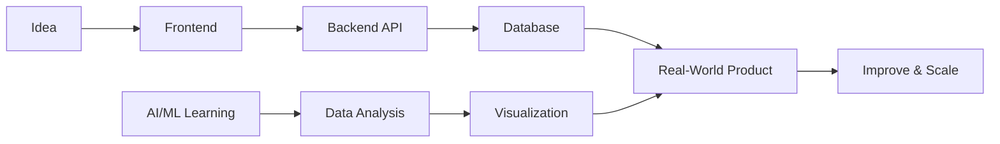

<div align="center">


<br />


</div>

<br />

<div align="center">


</div>

---

```bash
> whoami
Sanskar Bhanderi

> role
CSE Student | Full-Stack Developer | AI/ML Learner

> main_stack
Java, Python, TypeScript, React, Next.js, FastAPI, MySQL

> learning_path
Java DSA • Backend Engineering • AI/ML • Data Analytics • Scalable Systems
```

---

## ⚡ Developer Snapshot

I am a **CSE student** building real-world software products across **frontend, backend, databases and AI/ML**.

I enjoy converting ideas into working systems using clean UI, strong backend logic, database design and data-driven thinking.

```txt
Frontend        React • Next.js • TypeScript • Tailwind CSS
Backend         Python • FastAPI
Database        MySQL
DSA             Java
AI/ML & Data    NumPy • Pandas • Matplotlib • Seaborn
Focus           Full-Stack Systems • Backend Engineering • AI/ML
```

---

## 🧠 What I Work On

<table>
  <tr>
    <td width="50%">
      <h3>🖥️ Full-Stack Development</h3>
      <p>
        Building modern web apps with clean UI, reusable components,
        API integration and real-world product thinking.
      </p>
    </td>
    <td width="50%">
      <h3>⚙️ Backend Engineering</h3>
      <p>
        Creating APIs, working with databases, writing backend logic
        and learning how scalable systems are designed.
      </p>
    </td>
  </tr>
  <tr>
    <td width="50%">
      <h3>🤖 AI/ML Learning</h3>
      <p>
        Exploring machine learning fundamentals, data analysis,
        visualization and intelligent software applications.
      </p>
    </td>
    <td width="50%">
      <h3>☕ Java DSA</h3>
      <p>
        Strengthening problem-solving skills through data structures,
        algorithms and interview-focused coding practice.
      </p>
    </td>
  </tr>
</table>

---

## 🛠️ Tech Stack

<div align="center">

### 💻 Languages


<br />
<br />


<br />
<br />

### 🎨 Frontend


<br />
<br />


<br />
<br />

### ⚙️ Backend & Database


<br />
<br />


<br />
<br />

### 🤖 AI/ML & Data Analytics


<br />
<br />

### 🧰 Tools


<br />
<br />


</div>

---

## 🚀 Build Pipeline



---

## 🔥 Current Focus

<table>
  <tr>
    <td>🚀</td>
    <td><b>Full-Stack Projects</b></td>
    <td>Building practical web apps from frontend to backend</td>
  </tr>
  <tr>
    <td>⚙️</td>
    <td><b>Backend Engineering</b></td>
    <td>Learning APIs, databases, authentication and system design basics</td>
  </tr>
  <tr>
    <td>☕</td>
    <td><b>Java DSA</b></td>
    <td>Improving problem-solving for coding interviews</td>
  </tr>
  <tr>
    <td>🤖</td>
    <td><b>AI/ML</b></td>
    <td>Learning data analysis, ML fundamentals and intelligent systems</td>
  </tr>
</table>

---

## 🧩 Projects & Systems

### 🐚 Java Shell Project

A custom shell built in Java with command execution, built-in commands, path lookup and shell-like behavior.

### 🚌 Public Transport Tracker

A React-based route tracking app with route selection, refresh functionality and live-style updates.

### 🎵 Music Streaming Platform

A full-stack music platform idea using **Next.js, FastAPI, MySQL and Redis** with scalable product architecture.

### 📊 Data Analytics Work

Exploring datasets using **NumPy, Pandas, Matplotlib and Seaborn** to understand patterns, trends and insights.

---

## 📊 GitHub Intelligence

<div align="center">


<br />
<br />


</div>

---

## 📈 Contribution Activity

<div align="center">


</div>

---

## 🧭 Developer Mindset

```txt
Learn the fundamentals.
Build real projects.
Think like an engineer.
Improve through consistency.
Ship, break, debug, repeat.
```

---

## 🤝 Connect

<div align="center">

<p>
  Open to learning, collaborating and building real-world software products.
</p>

<a href="https://github.com/ItsSanskar8">
  
</a>

</div>

---

<div align="center">

### ⚡ Full-Stack Development × Backend Engineering × AI/ML Learning

</div>
