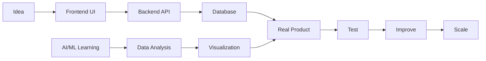
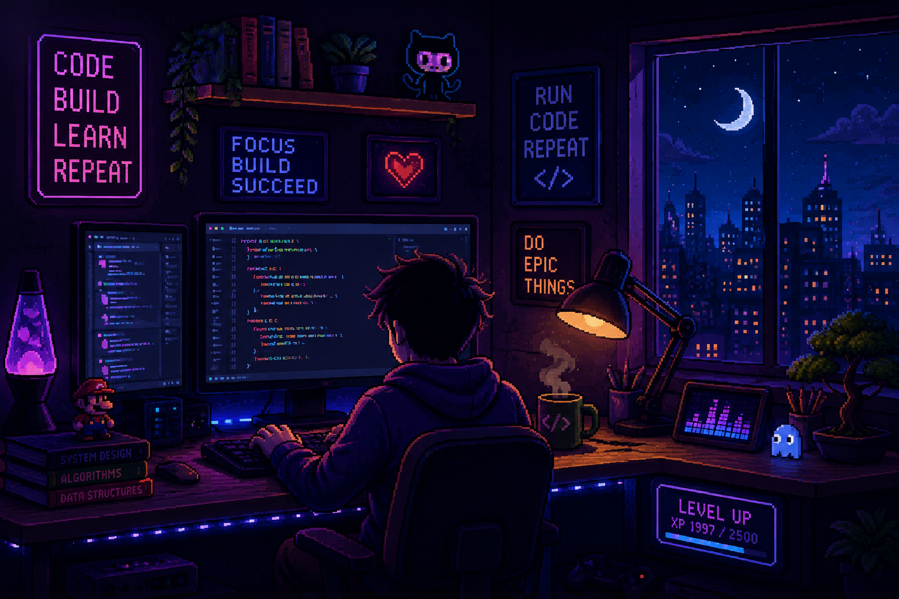

<div align="center">


<br />


</div>

<br />

<div align="center">


</div>

---

```bash
> whoami
Sanskar Bhanderi

> role
CSE Student | Full-Stack Developer | AI/ML Learner

> main_stack
Java, Python, TypeScript, React, Next.js, FastAPI, MySQL

> current_focus
Full-Stack Development • Backend Engineering • Java DSA • AI/ML • Data Analytics

> mindset
Ship. Debug. Improve. Repeat.
```

---

## ⚡ Developer Snapshot

I am a **CSE student** and **full-stack developer** focused on building practical software products with strong frontend, backend, database and AI/ML foundations.

I enjoy converting ideas into working systems using **clean UI**, **structured backend logic**, **database design**, and **data-driven thinking**.

```txt
Frontend        React • Next.js • TypeScript • Tailwind CSS
Backend         Python • FastAPI
Database        MySQL
DSA             Java
AI/ML & Data    NumPy • Pandas • Matplotlib • Seaborn
Focus           Full-Stack Systems • Backend Engineering • AI/ML
Goal            Build real-world scalable products
```

---

## 🧠 What I Work On

<table>
  <tr>
    <td width="50%">
      <h3>🖥️ Full-Stack Development</h3>
      <p>
        Building modern web applications with clean UI, reusable components,
        routing, API integration and real-world product thinking.
      </p>
    </td>
    <td width="50%">
      <h3>⚙️ Backend Engineering</h3>
      <p>
        Creating APIs, connecting databases, writing backend logic
        and learning how scalable systems are designed.
      </p>
    </td>
  </tr>
  <tr>
    <td width="50%">
      <h3>🤖 AI/ML Learning</h3>
      <p>
        Exploring machine learning fundamentals, data analysis,
        visualization and intelligent software applications.
      </p>
    </td>
    <td width="50%">
      <h3>☕ Java DSA</h3>
      <p>
        Strengthening problem-solving skills through data structures,
        algorithms and interview-focused coding practice.
      </p>
    </td>
  </tr>
</table>

---

## 🛠️ Tech Stack

<div align="center">

### 💻 Languages


<br />
<br />


<br />
<br />

### 🎨 Frontend


<br />
<br />


<br />
<br />

### ⚙️ Backend & Database


<br />
<br />


<br />
<br />

### 🤖 AI/ML & Data Analytics


<br />
<br />

### 🧰 Tools


<br />
<br />


</div>

---

## 🚀 Build Pipeline


```mermaid
flowchart LR
    A[Idea] --> B[Frontend UI]
    B --> C[Backend API]
    C --> D[Database]
    D --> E[Real Product]
    E --> F[Test]
    F --> G[Improve]
    G --> H[Scale]

    I[AI/ML Learning] --> J[Data Analysis]
    J --> K[Visualization]
    K --> E
```

---

## 🔥 Current Focus

<table>
  <tr>
    <td>🚀</td>
    <td><b>Full-Stack Projects</b></td>
    <td>Building practical web apps from frontend to backend</td>
  </tr>
  <tr>
    <td>⚙️</td>
    <td><b>Backend Engineering</b></td>
    <td>Learning APIs, databases, authentication and system design basics</td>
  </tr>
  <tr>
    <td>☕</td>
    <td><b>Java DSA</b></td>
    <td>Improving problem-solving for coding interviews</td>
  </tr>
  <tr>
    <td>🤖</td>
    <td><b>AI/ML</b></td>
    <td>Learning data analysis, ML fundamentals and intelligent systems</td>
  </tr>
</table>

---

## 🧩 Featured Projects

<table>
  <tr>
    <td width="50%">
      <h3>🐚 Java Shell Project</h3>
      <p>
        A custom shell built in Java with command execution, built-in commands,
        path lookup and shell-like behavior.
      </p>
      <p>
        
        
      </p>
    </td>
    <td width="50%">
      <h3>🚌 Public Transport Tracker</h3>
      <p>
        A React-based route tracking app with route selection,
        refresh functionality and live-style updates.
      </p>
      <p>
        
        
      </p>
    </td>
  </tr>
  <tr>
    <td width="50%">
      <h3>🎵 Music Streaming Platform</h3>
      <p>
        A full-stack music platform idea using Next.js, FastAPI,
        MySQL and Redis with scalable product architecture.
      </p>
      <p>
        
        
        
      </p>
    </td>
    <td width="50%">
      <h3>📊 Data Analytics Work</h3>
      <p>
        Exploring datasets using NumPy, Pandas, Matplotlib and Seaborn
        to understand patterns, trends and insights.
      </p>
      <p>
        
        
      </p>
    </td>
  </tr>
</table>

---

## 📊 GitHub Intelligence

<div align="center">


<br />
<br />


</div>

---

## 📈 Contribution Activity

<div align="center">


</div>

---

## 🧭 Developer Mindset

```txt
Learn the fundamentals.
Build real projects.
Think like an engineer.
Improve through consistency.
Ship, break, debug, repeat.
```

---

## 📬 Let's Connect

<div align="center">

<p>
  Open to learning, collaborating and building impactful software products.
</p>

<a href="https://github.com/ItsSanskar8" target="_blank">
  
</a>

<a href="https://www.linkedin.com/in/sanskar-bhanderi-6098a4378/" target="_blank">
  
</a>

<a href="https://x.com/ItsSanskar8" target="_blank">
  
</a>

<br />
<br />



<br />
<br />

### ⚡ Full-Stack Development × Backend Engineering × AI/ML Learning

```txt
Thanks for visiting. Star some repos if you like my work.
```

</di>
